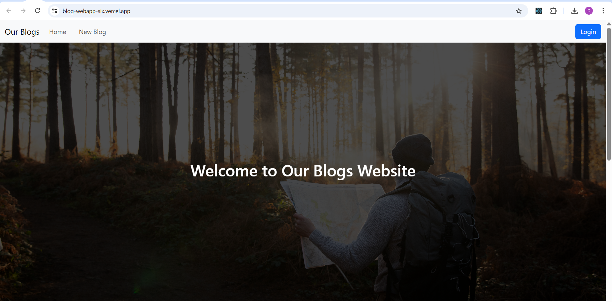

# 📝 BlogWebApp — Full Stack Blog Web Application

BlogWebApp is a responsive full-stack blogging web application where users can register, log in, read blogs, and create their own blogs categorized by topic. It also includes admin functionality for managing user content.

## 🚀 Features

- ✅ **User Authentication**
  - Register and login functionality
  - Secure password hashing with bcrypt

- ✅ **Blog Functionality**
  - Users can create blogs with:
    - Category
    - Title
    - Image (uploaded via **Cloudinary**)
    - Rich content (10–15 lines or more)
  - Blogs are displayed on the home page and categorized pages

- ✅ **Admin Access**
  - Admins can:
    - View all user blogs
    - Delete inappropriate or unnecessary blogs

- ✅ **Mobile Responsive**
  - Works well on all screen sizes (mobile, tablet, desktop)

---

## 🛠️ Technologies Used

### 🔷 Frontend
- [React](https://reactjs.org/)
- [Vite](https://vitejs.dev/)
- [Bootstrap 5](https://getbootstrap.com/)
- HTML5, CSS3, JavaScript
- **Deployed on:** [Vercel](https://vercel.com/)

### 🔶 Backend
- [Node.js](https://nodejs.org/)
- [Express.js](https://expressjs.com/)
- [Cloudinary](https://cloudinary.com/) for image storage
- [MySQL](https://www.mysql.com/) for database
- **Deployed on:** [Render](https://render.com/)

### 🗃️ Database
- MySQL hosted and deployed on **Railway**

---

## 📸 Demo

Here's a preview of the Blog Website:




---

## 📦 Project Structure

```bash
Our-Blogs/
├── blogwebsite/        # Frontend (React + Vite)
└── blogserver/         # Backend (Node.js + Express)


